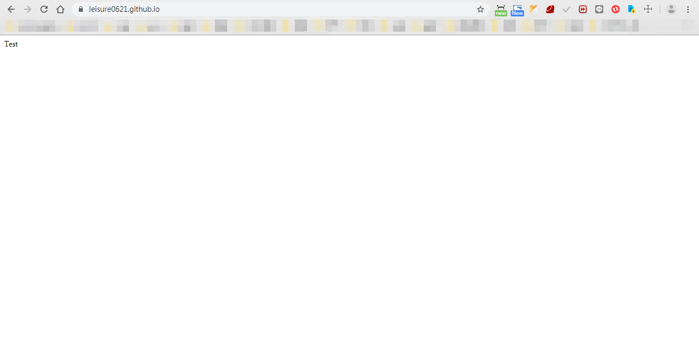
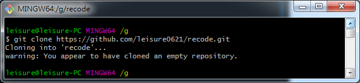
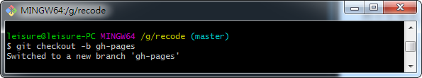

<h1>用 github pages 建立 Blog!</h1>

- [什么是 github pages?](#s1)
- [为什么要使用 github pages?](#s2)
- [开始建立 github pages](#s3)
  - [建立前的准备](#s4)
  - [建立一个仓库(Repository)](#s5)
  - [编辑第一个页面](#s6)
  - [将页面推送上线](#s7)
  - [浏览器上查看](#s8)
- [建立其他项目仓库](#s9)
  - [在本地指定目录 clone 项目](#s10)
  - [建立 gh-pages branch](#s11)
  - [在浏览器上查看](#s12)
  - [延伸问题](#s13)
- [总结](#s14)

---

## 什么是 github pages?<span id="s1"/>

GitHub Pages 是 GitHub 提供的一个网页寄存服务，于 2008 年推出。可以用于存放静态网页，包括博客、项目文档甚至整本书。Jekyll 软件可以用于将文档转换成静态网页，该软件提供了将网页上传到 GitHub Pages 的功能

─ 维基百科

## 为什么要使用 github pages?<span id="s2"/>

虽然说 GitHub Pages 是 GitHub 提供的一个网页寄存服务，但 github 使用人数非常多，且使用 GitHub Pages 的话无须重新配置新的域名，使用几个步骤即可搭建好一个静态网站。

1. 若只是用于分享技术的话是个很好的平台，且技术难度低!

2. 之后也能将代码直接放置在 github 仓库中，优化简历与作品。

3. 若平时有试着习惯撰写技术文章的话，对沟通与代码的理解性也能更高。

## 开始建立 github pages<span id="s3"/>

#### 建立前的准备<span id="s4"/>

1. 需要先[建立 git 帐号](https://github.com/)

2. 需要[下载并安装](https://git-scm.com/downloads)好 git

#### 建立一个仓库(Repository)<span id="s5"/>

登录[github](https://github.com/)后，点击右上角的 「+」 并选择 「New repository」


Repository name 中输入 「githubAccount.github.io」，输入完后点击下方的 「Create resposltory」


接着就能看见的画面，之后可在「Your profile」中查看刚刚建立的项目。进入项目后上面有你项目的 git 仓库链接，你能够依照上面所教的步骤在你的电脑上部属。或用「git clone 仓库地址」的方式设置（在使用 git 代码前你首先要去[下载 git](https://git-scm.com/downloads)，才能在电脑上使用）


#### 编辑第一个页面<span id="s6"/>

在设置好项目后，进入目录中。并在该目录下新增一页「index.html」(页面内容能自行编辑)。在推送上线后打开链接，就能直接查看该页面。

1. 项目位置，依据个人设置的项目位置进入(以下范例为本项目在电脑上配置的目录)。

```git
G:\leisure0621.github.io
```

2. 文件内容，可以依需求自行修改，也可参考以下代码。

```html
<!DOCTYPE html>
<html lang="en">
  <head>
    <meta charset="UTF-8" />
    <meta name="viewport" content="width=device-width, initial-scale=1.0" />
    <meta http-equiv="X-UA-Compatible" content="ie=edge" />
    <title>Home Page</title>
  </head>
  <body>
    Home Page
  </body>
</html>
```

#### 将页面推送上线<span id="s7"/>

1. 添加待推送档案(add 后面加 . 表示所有修改过的档案都要添加)。

```git
git add .
```


1. 添加事件名称(名称必须填写的让人明白此次更新的原因)。

```git
git commit -m 'my first commit'
```


3. 推送上线。

```git
git push
```


如果需要更细的用法可以至网上搜寻[git push](https://blog.csdn.net/qq_37577660/article/details/78565899)等相关的关键字进行查找，而在当前项目中推送的方式只使用 git push 的原因为，此项目仅有一个线上分支。所以可用此方法直接推送。

#### 浏览器上查看<span id="s8"/>

在浏览器中输入「https://githubAccount.github.io」就可看见刚刚编辑好的画面



如果只有一个项目的时候，所有的页面都可以写在一个仓库当中。但假设越来越多页面的话，应该将每个独立的项目设置为一个独立的 repository，未来假设有需要更改。或查看 commit 时也会更清晰，不容易混淆。

将每个不关联的项目分开，并将每次 commit 的消息定义的清晰让人一眼可明白此次修改的事件主要有哪些，也是未来该练习的事。

## 建立其他项目仓库<span id="s9"/>

跟一般[建立 Repository](https://github.com/new)的方式相同，但此时已经**不需要**像刚开始那样输入「githubAccount.github.io」，而是直接输入「项目名称」就能够直接创建。


#### 在本地指定目录 clone 项目<span id="s10"/>

```git
git clone 仓库链接
```



建立好后，若也在此项目中添加完需上线的资料，则**记得 push 上线**，都做好后则继续执行后续说明的 gh-pages branch 指令。

#### 建立 gh-pages branch<span id="s11"/>

gh-pages branch 主要是为了上面所说的事情，「将不关连的项目拆分」以让每个工程的定义更清晰明确，详细依照下方三步骤执行。

1. 建立并进入 gh-pages 分支。

```git
git checkout -b gh-pages
```



2. 新增 Readme.md > `git add .` > `git commit -m '第一個推送'` (如果 git 創建時就有 readme，可跳過此步驟)

3. 将分支推送上线。

```git
git push --set-upstream origin gh-pages
```


4. 将新 commit 推送上线。

```git
git push
```


#### 在浏览器上查看<span id="s12"/>

此时项目目录为此:

```cs
.
|
+---github-pages
|       index.html
|       index.md
|
\---image
```

在浏览器上打开 https://githubAccount.github.io/projectFolder/ (依据项目目录，此时需打开的 projectFolder 应是 github-pages，且显示的内容为 index.html 中的资料)。


#### 延伸问题<span id="s13"/>

```js
「gh-pages」 跟「githubAccount.github.io」站互相会有什么影响？
```

在 gh-pages 中如果已经有建立一个项目 A、在主页中也建立一个项目 A 的资料夹的话，会以 gh-pages 的项目 A 为主。即只会显示 gh-pages 的项目资料。

这时就能做到资料拆分的作用，自然的以后也不需要在主页的项目中放多馀的项目文件进去了。

## 总结<span id="s14"/>


